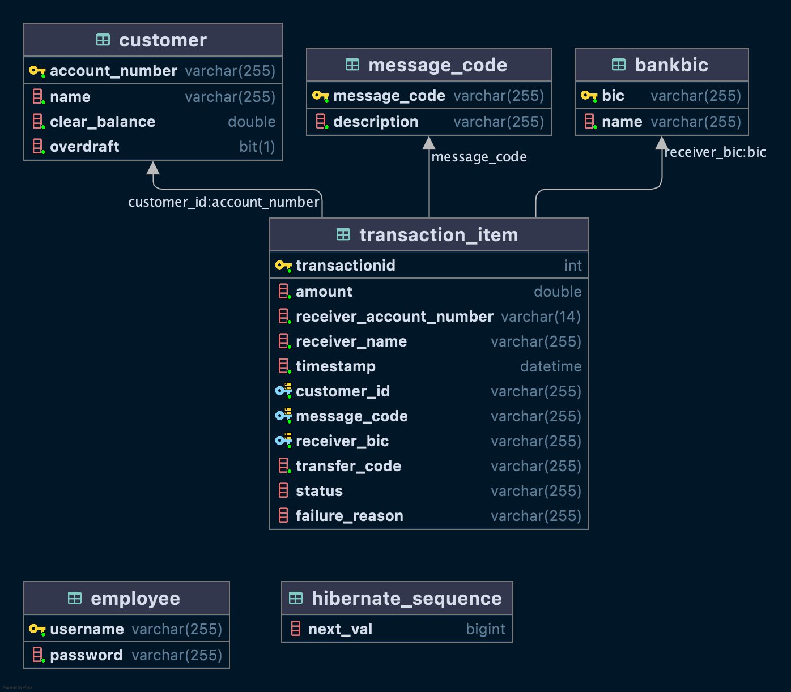

# Simple Payment Back-end

A REST API with minimal api endpoints with CRUD operations with MySQL5 Database

Front-end for this project is integrated at @[Payment Angular](https://github.com/keshavlingala/payment-angular)

## List of Endpoints

> API Endpoints Docs Generated using OpenAPI

## Database Design

